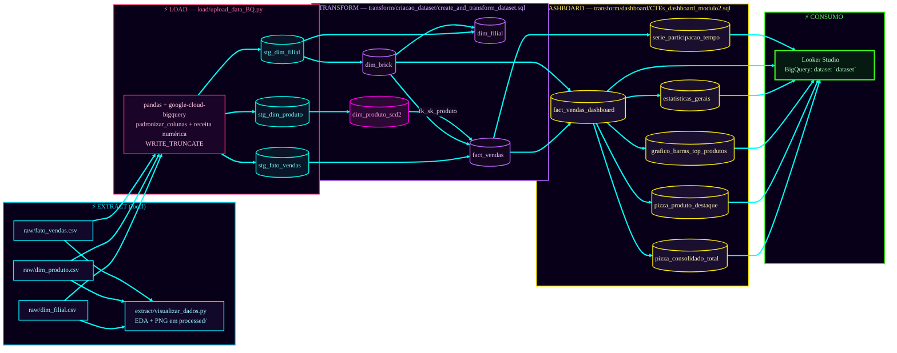

# Arquitetura — Projeto avaliativo Módulo 2 (Clamed)

Projeto alinhado ao **enunciado** (`enunciado.txt`): arquitetura **Medallion**, **Python + Pandas** para leitura e tratamento, **BigQuery** como “nuvem” (Opção B estendida com SQL analítico), **EDA com Matplotlib** e **Looker Studio** para consumo.

**Pipeline real:** CSVs em `raw/` → carga com Python no BigQuery (staging) → transformação SQL (modelo dimensional + fato) → tabelas materializadas para dashboard → Looker Studio.



## Resumo por etapa

| Etapa | O que acontece |
|-------|----------------|
| **Bronze (Raw)** | Três CSVs imutáveis em `raw/`: `dim_filial.csv`, `dim_produto.csv`, `fato_vendas.csv` (colunas conforme amostra do curso). |
| **Extract / EDA** | `extract/visualizar_dados.py` — análise exploratória (tipos, nulos, cardinalidade), `snake_case` via `padronizar_colunas`, coerção de `receita` para gráficos (`preparar_vendas_para_grafico`), PNG em `processed/relatorio_estatistico/`. O pacote `extract` é importável (`extract/__init__.py`). |
| **Load (staging BQ)** | `load/upload_data_BQ.py` — lê os CSVs, reutiliza `padronizar_colunas` + `preparar_vendas_para_grafico`, cria o dataset se não existir e carrega com `WRITE_TRUNCATE` para `stg_dim_filial`, `stg_dim_produto`, `stg_fato_vendas` no dataset **`staging_modulo2`** (padrão). Variáveis: `GCP_PROJECT_ID`, `BQ_DATASET_ID`, `BQ_LOCATION`. |
| **Silver (trusted BQ)** | `transform/criacao_dataset/create_and_transform_dataset.sql` — lê staging em `` `projeto-modulo2.staging_modulo2` `` e grava em `` `projeto-modulo2.dataset` ``: `dim_brick` → `dim_filial` → `dim_produto_scd2` → `fact_vendas` (join inner com `dim_filial`; `LEFT JOIN` produto ativo). |
| **Gold (dashboard BQ)** | `transform/dashboard/CTEs_dashboard_modulo2.sql` — materializa `fact_vendas_dashboard`, pizzas, top produtos, `estatisticas_gerais` e `serie_participacao_tempo` (série mensal de shares). |
| **Looker Studio** | Conecta ao BigQuery; guia de campos e storytelling em `transform/dashboard/guia_dashboard_banca_modulo2.md`. |

## Dados brutos (`raw/`)

| Arquivo | Conteúdo (grão) |
|---------|------------------|
| `dim_filial.csv` | Loja: `filial_id`, `brick`, `regiao`, `cluster`. |
| `dim_produto.csv` | Produto: `produto_id`, `categoria`, `nome_produto`. |
| `fato_vendas.csv` | Venda: `data`, `produto_id`, `filial_id`, `empresa`, `volume`, `preco_unitario`, `receita` (pode conter texto inválido em `receita`; tratado no Python antes da carga). |

## Como executar (ordem)

1. **Credenciais Google Cloud** (Application Default ou conta de serviço) com permissão no projeto e datasets.
2. **Ambiente Python** na pasta `projeto/` (ex.: `python -m venv .venv` e instalar `pandas`, `google-cloud-bigquery`, `pyarrow`, `matplotlib`).
3. **Carga staging:** `python load/upload_data_BQ.py`
4. **Silver:** executar no BigQuery o script `transform/criacao_dataset/create_and_transform_dataset.sql`.
5. **Gold / dashboard:** executar `transform/dashboard/CTEs_dashboard_modulo2.sql`.
6. **EDA local (opcional):** `python extract/visualizar_dados.py`

## Observações técnicas importantes

- No SQL do dashboard, os campos `vol_*` representam **receita** repartida por `empresa` (nomenclatura herdada do template IQVIA). `vol_concorrente_indep` tende a **zero** se só existirem `Clamed` e `Concorrente` no fato.
- A tabela `serie_participacao_tempo` expõe `receita_clamed`, `receita_rede`, `share_clamed_pct` e `share_rede_pct`; **não** expõe `receita_total` no `SELECT` final — use `receita_rede > 0` ou acrescente a coluna no SQL se precisar dela no Looker.
- O enunciado pede também **view `vw_market_share_mensal` com MoM**, **KPIs adicionais** (gap de preço, brick com maior potencial), **mapa/treemap por brick** e **filtros** (brick, mês, categoria). O que está neste repositório cobre o núcleo de **market share + série temporal + guia de banca**; complete o restante conforme o roteiro da disciplina.

## Estrutura de pastas

```
projeto/
  raw/                 # Bronze
  extract/             # EDA + funções reutilizadas na carga
  load/                # Carga BigQuery (staging)
  transform/
    criacao_dataset/   # SQL silver
    dashboard/         # SQL gold + guia Looker
  processed/           # Saída EDA (PNG)
  enunciado.txt
  sbs.md
```
